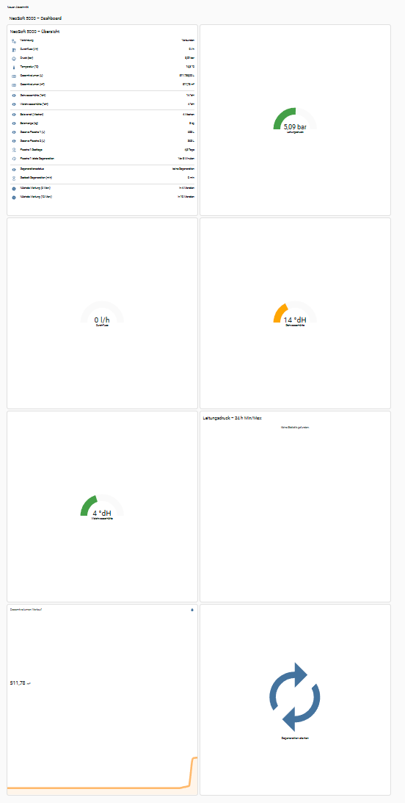

# NeoSoft Connect 5000 – Home Assistant Integration

Dieses Projekt bindet eine **SYR NeoSoft Connect 5000**-Enthärtungsanlage vollumfänglich in Home Assistant ein:

| Funktion | Beschreibung |
|----------|--------------|
| **REST-Paket** `neosoft_connect.yaml` | holt alle Betriebsdaten (Flow, Druck, Temperatur, Volumen, Härte-Werte, Salz-/Reserve-Level, Regeneration, Wartung) direkt vom Steuerkopf  `http://<IP>:5333/neosoft/get/*` |
| **Template-Sensoren** | • Gesamtvolumen *m³*  • Restreichweite Reserve-Flasche 1 (Tage)  • Timestamp der letzten Regeneration F1 |
| **Utility-Meter** | Tages- & Monats-Verbrauch (Liter & m³) |
| **REST-Command** | manueller Regenerations-Trigger |
| **Lovelace-Dashboard** | 2-Spalten-Grid mit:  • Live-Übersicht aller Sensoren  • Gauges (Druck, Durchfluss, Roh/Weichwasser)  • 24 h-Min/Max-Statistik für Leitungsdruck  • Verlauf Gesamtvolumen  • Button „Regeneration starten“ |

---

## Voraussetzungen

* SYR NeoSoft Connect 5000 mit aktivierter Lokalschnittstelle (Port **5333**)
* Sie müssen die IP-Adresse noch in den YAML hinzufügen die ihre SYR Neosoft hat.
* Home Assistant ≥ 2023.9 (wegen *statistics-graph*-Card)
* Ordner-Struktur  
